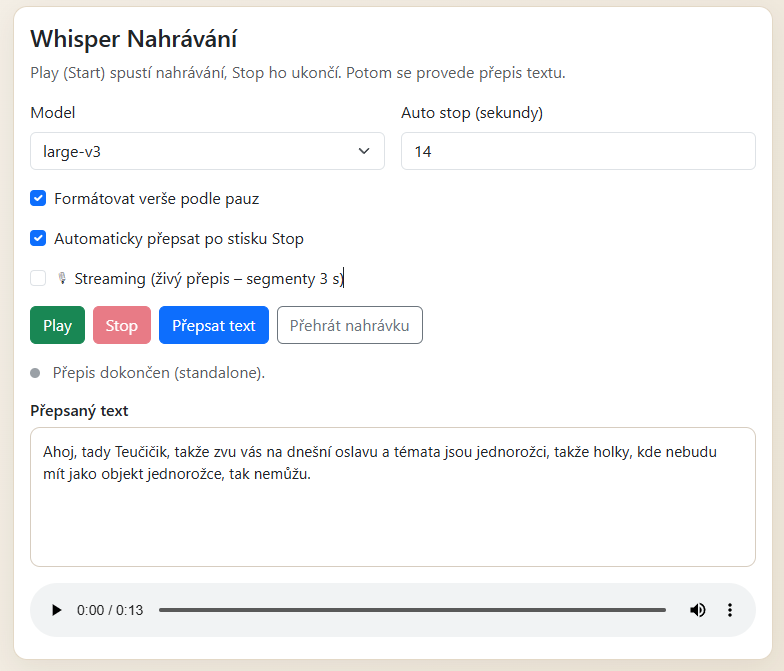
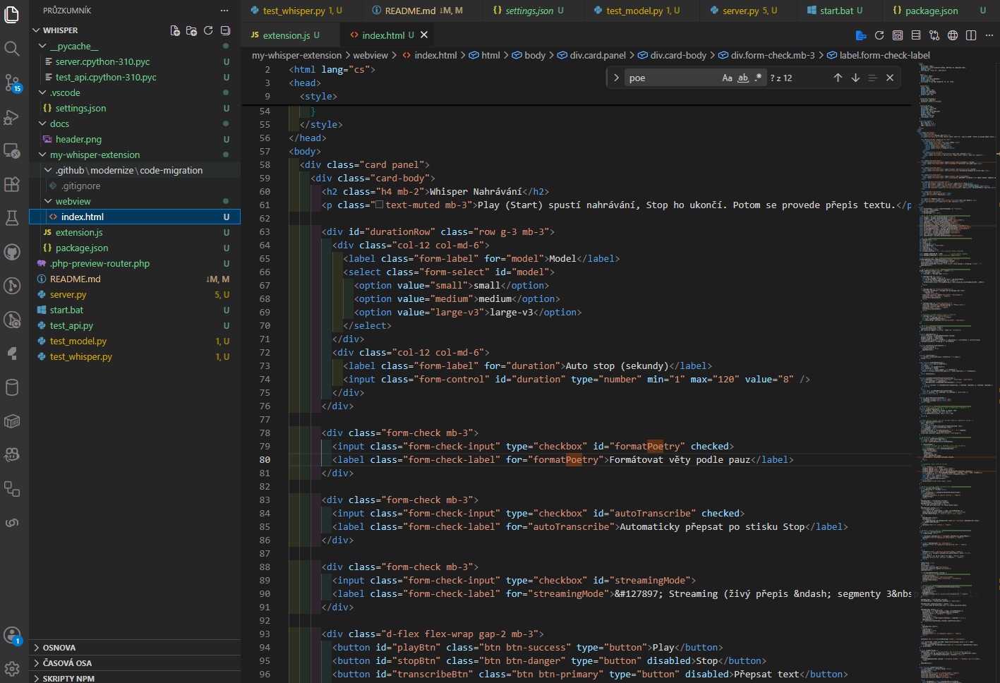

# 🇨🇿 **README.md (CZ verze)**

```markdown
# Whisper Streaming – Přepis mluveného slova do textu v reálném čase (FastAPI + Faster‑Whisper + VS Code Extension)


*(placeholder – vlož vlastní obrázek)*

Whisper Streaming je lokální nástroj pro **přepis mluveného slova do textu v reálném čase**, optimalizovaný pro **češtinu**, **poezii** a **rychlou práci v editoru**.

Projekt kombinuje:

- **Faster‑Whisper (large‑v3)** – extrémně rychlý GPU přepis  
- **FastAPI backend** – lokální REST API + streaming endpoint  
- **VS Code Extension** – nahrávání mikrofonu a živé vkládání textu do editoru  
- **Streaming audio chunks (250–500 ms)** – realtime přepis bez čekání  

Celý systém běží **lokálně**, bez cloudu a bez odesílání dat mimo počítač.

---

## ✨ Funkce

- 🎤 Živý přepis hlasu (streaming, žádné čekání na konec nahrávky)
- ⚡ GPU akcelerace (CUDA 12.1, PyTorch)
- 🧠 Whisper large‑v3 – nejlepší model pro češtinu
- 📝 Automatické vkládání textu do VS Code editoru
- 📐 Optimalizace pro poezii (pauzy → verše)
- 🌐 FastAPI backend (REST + streaming endpoint)
- 🔒 100% lokální běh
- 🧩 Modulární architektura – backend + extension

---

## 📦 Architektura



### **1) VS Code Extension**
- nahrává mikrofon pomocí `MediaRecorder`
- každých 250–500 ms odesílá audio chunk
- přijímá text a vkládá ho do editoru

### **2) FastAPI Backend**
- endpoint `/stream` pro realtime přepis  
- endpoint `/transcribe` pro dávkový přepis  
- běží na `http://127.0.0.1:5005`

### **3) Faster‑Whisper**
- model: `large-v3`  
- běží na GPU (`float16`)  
- extrémně rychlý přepis i pro dlouhé věty  

---

## 🚀 Instalace

### 1) Klonování repozitáře

```bash
git clone https://github.com/PajaO1111/whisper-streaming.git
cd whisper-streaming
```

### 2) Virtuální prostředí

```bash
python -m venv .venv
.\.venv\Scripts\activate
```

### 3) Instalace závislostí

```bash
pip install --upgrade pip
pip install fastapi uvicorn faster-whisper python-multipart
```

### 4) Instalace PyTorch s CUDA 12.1

```bash
pip install torch torchvision torchaudio --index-url https://download.pytorch.org/whl/cu121
```

---

## ▶️ Spuštění backendu

### Windows (doporučeno)

```bash
start.bat
```

### Ručně

```bash
python server.py
```

Backend běží na:

```
http://127.0.0.1:5005
```

Health check:

```
http://127.0.0.1:5005/health
```

---

## 🧪 Testy

```bash
python -m unittest test_api.py
python test_whisper.py
python test_model.py
```

---

## 🧩 VS Code Extension

Složka:

```
my-whisper-extension/
```

### Spuštění extension

1. Otevři složku `my-whisper-extension` ve VS Code  
2. Stiskni **F5**  
3. V novém okně spusť příkaz:

```
Whisper: Diktovat poezii
```

---

## 🛠 Známé poznámky

- `/transcribe` vrací text až po dokončení celé nahrávky  
- `/stream` je optimalizovaný pro krátké segmenty (250–500 ms)  
- jazyk je nastaven na češtinu (`language="cs"`)  

---

## 📄 Licence

MIT  
Autor: **Pavel Oulehle**

```

---

# 🇬🇧 **README.md (EN version)**

```markdown
# Whisper Streaming – Realtime Czech Speech‑to‑Text (FastAPI + Faster‑Whisper + VS Code Extension)


*(placeholder – insert your own image)*

Whisper Streaming is a local tool for **real‑time speech‑to‑text transcription**, optimized for **Czech language**, **poetry**, and **fast writing workflows inside VS Code**.

The project combines:

- **Faster‑Whisper (large‑v3)** – extremely fast GPU transcription  
- **FastAPI backend** – local REST API + streaming endpoint  
- **VS Code Extension** – microphone recording and live text insertion  
- **Streaming audio chunks (250–500 ms)** – realtime transcription without waiting  

Everything runs **locally**, with **no cloud** and **no data leaving your machine**.

---

## ✨ Features

- 🎤 Live speech transcription (streaming)
- ⚡ GPU acceleration (CUDA 12.1, PyTorch)
- 🧠 Whisper large‑v3 – excellent Czech accuracy
- 📝 Automatic text insertion into VS Code editor
- 📐 Poetry‑aware formatting (pauses → line breaks)
- 🌐 FastAPI backend (REST + streaming)
- 🔒 Fully local processing
- 🧩 Modular architecture – backend + extension

---

## 📦 Architecture


*(placeholder – insert your own image)*

### **1) VS Code Extension**
- records microphone using `MediaRecorder`
- sends audio chunks every 250–500 ms
- inserts partial text into the editor

### **2) FastAPI Backend**
- `/stream` endpoint for realtime transcription  
- `/transcribe` endpoint for batch transcription  
- runs on `http://127.0.0.1:5005`

### **3) Faster‑Whisper**
- model: `large-v3`  
- GPU inference (`float16`)  
- extremely fast even for long sentences  

---

## 🚀 Installation

### 1) Clone the repository

```bash
git clone https://github.com/PajaO1111/whisper-streaming.git
cd whisper-streaming
```

### 2) Virtual environment

```bash
python -m venv .venv
.\.venv\Scripts\activate
```

### 3) Install dependencies

```bash
pip install --upgrade pip
pip install fastapi uvicorn faster-whisper python-multipart
```

### 4) Install PyTorch with CUDA 12.1

```bash
pip install torch torchvision torchaudio --index-url https://download.pytorch.org/whl/cu121
```

---

## ▶️ Running the backend

### Windows (recommended)

```bash
start.bat
```

### Manual

```bash
python server.py
```

Backend runs at:

```
http://127.0.0.1:5005
```

Health check:

```
http://127.0.0.1:5005/health
```

---

## 🧪 Tests

```bash
python -m unittest test_api.py
python test_whisper.py
python test_model.py
```

---

## 🧩 VS Code Extension

Folder:

```
my-whisper-extension/
```

### Run the extension

1. Open the folder in VS Code  
2. Press **F5**  
3. In the new window run:

```
Whisper: Dictate Poetry
```

---

## 📄 License

MIT  
Author: **Pavel Oulehle**

